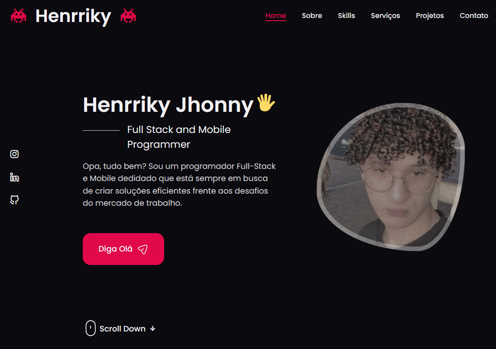

<h4 align="center"> 
	🚀 Portfólio 🚀
</h4>

  

  

# ✅ Objetivo

- Portfolio oficial do meu perfil desenvolvido com React, com o objetivo de resumir minhas qualificações profissionais, projetos e conhecimentos em um único lugar. Contém responsividade e aplicação de boas práticas de programação.

# 🎮 Deploy

- Para ver o site, [clique aqui](https://portfolio-henrriky-24rfqw0h7-henrriky.vercel.app)

# 🎮 Tecnologias e Ferramentas

- HTML, CSS, Javascript
- React
- NPM
- Git & Github
- Vercel (Deploy)
- [Boxicons](https://boxicons.com/usage);
- [Unicons](https://iconscout.com/unicons);
- [swipper.js](https://swiperjs.com/)
- [emailjs](https://www.emailjs.com/)

